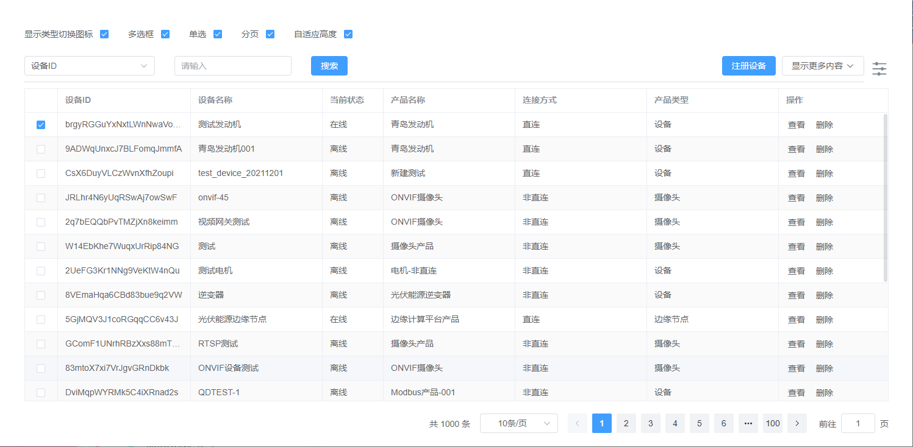
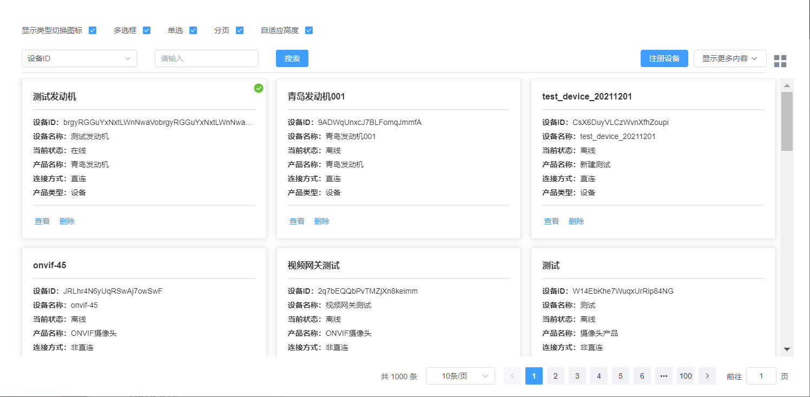

# ElTableChen

> 表格组件：1、集成 el-table 与 el-pagination 组件为一体,可进行前后端分页；2、表格高度自适应；3、表格与卡片两种展现方式；

## 安装

- 1. 由于组件依赖 element-plus,所以项目需要引入[element-plus](https://element-plus.gitee.io/zh-CN/guide/installation.html#%E4%BD%BF%E7%94%A8%E5%8C%85%E7%AE%A1%E7%90%86%E5%99%A8)

- 2.  安装 ElTableChen
      ```shell
      npm i el-table-chen-plus -S
      ```

## 注册

```javascript
import ElTableChen from "el-table-chen-plus";
import "el-table-chen-plus/lib/style.css";
app.use(ElTableChen, {
  containerId: "app", // 全局配置容器id
  responseFn: function (res) {
    // 全局ajax请求成功后的回调函数，可不配置
    this.dataSource.length = 0;
    if (res && res.data && Array.isArray(res.data)) {
      this.dataSource.splice(0, 0, ...(res.data || []));
      this.total = dataSource.length;
    } else {
      this.dataSource.splice(
        0,
        0,
        ...(res && res.data && res.data.list ? res.data.list : [])
      );
      this.total = res.data.totalCount;
    }
    // 如果数据为空并且当前页码大于1,则页码减一重新获取数据
    this.againGetData();
  },
});
```

## 效果图

<p>表格</p>
<p align="center">

</p>
<p>卡片</p>
<p align="center">

</p>

## 使用示例

```javascript
<template>
  <div id="app">
    <div class="">
      <el-form :inline="true">
        <el-form-item label="显示类型切换图标">
          <el-checkbox v-model="elTableChenConfig.toggleConfig.show" />
        </el-form-item>
        <el-form-item label="多选框">
          <el-checkbox v-model="elTableChenConfig.selection" />
        </el-form-item>
        <el-form-item label="单选">
          <el-checkbox v-model="elTableChenConfig.single" />
        </el-form-item>
        <el-form-item label="分页">
          <el-checkbox v-model="elTableChenConfig.pagination" />
        </el-form-item>
        <el-form-item label="自适应高度">
          <el-checkbox v-model="elTableChenConfig.autoHeight" />
        </el-form-item>
      </el-form>
    </div>

    <ElTableChen
      v-bind="elTableChenConfig"
      ref="elTableChen"
      @cell-click="cellClick"
    >
      <template #header="{ $data }">
        <div class="header-wrapper">
          <div
            class="dflex form-wrapper"
            style="justify-content: space-between"
          >
            <el-form :inline="true" :model="queryForm">
              <el-form-item label="">
                <el-select v-model="queryForm.selectKey" placeholder="设备名称">
                  <el-option
                    v-for="item in elTableChenConfig.columnsConfig"
                    :key="item.prop"
                    :label="item.label"
                    :value="item.prop"
                  >
                  </el-option>
                </el-select>
              </el-form-item>
              <el-form-item label="">
                <el-input
                  v-model="queryForm.value"
                  placeholder="请输入"
                ></el-input>
              </el-form-item>
              <el-form-item>
                <el-button @click="refreshTable()" type="primary"
                  >搜索</el-button
                >
              </el-form-item>
            </el-form>
            <div>
              <el-button type="primary"> 注册设备 </el-button>
              <el-dropdown :hide-on-click="false" style="margin-left: 10px">
                <el-button>
                  显示更多内容
                  <el-icon style="margin-left: 5px"><ArrowDown /></el-icon>
                </el-button>
                <template #dropdown>
                  <el-dropdown-menu>
                    <el-dropdown-item
                      v-for="item in elTableChenConfig.columnsConfig"
                      :key="item.prop"
                    >
                      <el-checkbox
                        :checked="!item.hidden"
                        @change="(val) => changeColumn(val, item)"
                        >{{ item.label }}</el-checkbox
                      >
                    </el-dropdown-item>
                  </el-dropdown-menu>
                </template>
              </el-dropdown>
            </div>
          </div>
        </div>
      </template>
      <template #keepAlive="{ scope }">
        <div>
          {{ scope.row.keepAlive ? "在线" : "离线" }}
        </div>
      </template>
      <template #card="{ scope }">
        <div>卡片自定义模板</div>
      </template>
      <template #handle>
        <div>
          <el-button type="primary" link>查看</el-button>
          <el-button type="primary" link><span>删除</span></el-button>
        </div>
      </template>
    </ElTableChen>
  </div>
</template>

<script setup>
import { reactive, nextTick, ref } from "vue";
import tableData from "./mock";

const elTableChen = ref(null);
const queryForm = reactive({
  selectKey: "code",
  value: "",
});
const elTableChenConfig = reactive({
  apiFn: (query) => {
    // 如果apiFn不为空，则调用此函数，否则数据表格数据直接读取tableData属性
    // 远程获取数据函数,函数需返回Promise，真实场景可以直接返回axios
    // demo
    console.log(query);
    return new Promise((resolve, reject) => {
      setTimeout(() => {
        // 返回数据默认为以下两种数据结构
        let data = { data: { list: tableData, totalCount: 1000 } };
        // let data = { data: tableData };
        resolve(data);
      }, 1000);
    });
  },
  responseFn: function (res) {
    // ajax请求成功后的回调函数,如果没有配置则用全局的回调或则默认的回调
    this.dataSource.length = 0;
    if (res && res.data && Array.isArray(res.data)) {
      this.dataSource.splice(0, 0, ...(res.data || []));
      this.total.value = dataSource.length;
    } else {
      this.dataSource.splice(
        0,
        0,
        ...(res && res.data && res.data.list ? res.data.list : [])
      );
      this.total.value = res.data.totalCount;
    }
    // 如果数据为空并且当前页码大于1,则页码减一重新获取数据
    this.againGetData();
  },
  type: "table", //card(卡片) or table(表格)
  containerId: "app", // 组件容器id
  toggleConfig: {
    //切换配置
    show: true, //是否显示
    tableSvgIcon: `<svg viewBox="0 0 1024 1024" xmlns="http://www.w3.org/2000/svg" data-v-029747aa=""><path fill="currentColor" d="M160 448a32 32 0 0 1-32-32V160.064a32 32 0 0 1 32-32h256a32 32 0 0 1 32 32V416a32 32 0 0 1-32 32H160zm448 0a32 32 0 0 1-32-32V160.064a32 32 0 0 1 32-32h255.936a32 32 0 0 1 32 32V416a32 32 0 0 1-32 32H608zM160 896a32 32 0 0 1-32-32V608a32 32 0 0 1 32-32h256a32 32 0 0 1 32 32v256a32 32 0 0 1-32 32H160zm448 0a32 32 0 0 1-32-32V608a32 32 0 0 1 32-32h255.936a32 32 0 0 1 32 32v256a32 32 0 0 1-32 32H608z"></path></svg>`, //表格svg图标
    cardSvgIcon: `<svg viewBox="0 0 1024 1024" xmlns="http://www.w3.org/2000/svg" data-v-029747aa=""><path fill="currentColor" d="M389.44 768a96.064 96.064 0 0 1 181.12 0H896v64H570.56a96.064 96.064 0 0 1-181.12 0H128v-64h261.44zm192-288a96.064 96.064 0 0 1 181.12 0H896v64H762.56a96.064 96.064 0 0 1-181.12 0H128v-64h453.44zm-320-288a96.064 96.064 0 0 1 181.12 0H896v64H442.56a96.064 96.064 0 0 1-181.12 0H128v-64h133.44z"></path></svg>`, //卡片svg图标
    tgClass: "", // 容器类名
  },
  tableConfig: {
    // 同el-table表格属性配置https://element-plus.gitee.io/zh-CN/component/table.html#table-%E5%B1%9E%E6%80%A7
    size: "default",
  },
  cardConfig: {
    // 卡片配置
    slotName: "", // 卡片插槽名
    grid: {
      // 卡片自适应布局配置
      xs: 24,
      sm: 12,
      md: 12,
      lg: 8,
    },
  },
  emptySlotName: "", // 没有数据插槽名
  columnsConfig: [
    // 表格列配置，同el-table-column配置https://element-plus.gitee.io/zh-CN/component/table.html#table-column-%E5%B1%9E%E6%80%A7；增加slotName属性，如果存在，则优先使用插槽名为slotName属性值的数据
    {
      prop: "code",
      label: "设备ID",
      minWidth: 100,
      fixed: "left",
      hidden: false,
    },
    {
      prop: "name",
      label: "设备名称",
      minWidth: 100,
      hidden: false,
    },
    {
      prop: "keepAlive",
      label: "当前状态",
      width: 100,
      slotName: "keepAlive",
      hidden: false,
    },
    {
      prop: "productName",
      label: "产品名称",
      minWidth: 100,
      hidden: false,
    },
    {
      prop: "productLinkName",
      label: "连接方式",
      minWidth: 100,
      hidden: false,
    },
    {
      prop: "productTypeName",
      label: "产品类型",
      minWidth: 100,
      hidden: false,
    },
    {
      prop: "handle",
      label: "操作",
      width: 180,
      fixed: "right",
      slotName: "handle",
      hidden: false,
      notDropDownItem: true,
    },
  ],
  query: "a=b&c=d", // 查询条件，字符串或者对象a=b&c=d、{a:b}；
  autoGetData: true, // 是否自动加载数据
  offsetHeight: 180, // 高度偏移,值越大组件高度越小
  selection: true, // 显示多选框
  single: true, // 单选
  pagination: true, // 分页
  pageSizes: [10, 20, 50, 70, 100], // 分页配置
  defaultPageSize: 10, // 默认分页大小
  pageLayout: "total, sizes, prev, pager, next, jumper", // 分页布局
  currentRow: true, // 当前行高亮
  noDefaultHeight: false, // 是否没有默认高度
  minHeight: 200, // 表格最小高度
  maxTableHeight: 5000000, // 表格最大高度
  autoHeight: true, // 自适应高度
  tableData: [], // 表格数据
  rowKey: "id", // 行key
  defaultSelectionKeys: [122], // 默认选中
  finishCallBack: () => {},
  language: "zh-cn", // 语言zh-cn、en
  changePageKeepSelection: true, // 只支持前端分页的情况（即apiFn不存在）, 切换分页是否保持上一页的选中
});
function refreshTable() {}
// 勾选"显示更多项目"调用
function changeColumn(val, item) {
  item.hidden = !val;
  nextTick(() => {
    elTableChen.value?.doLayout();
  });
}
function cellClick(row, column, cell, event) {
  console.log(row, column, cell, event);
}
</script>

<style>
#app {
  font-family: "Avenir", Helvetica, Arial, sans-serif;
  -webkit-font-smoothing: antialiased;
  -moz-osx-font-smoothing: grayscale;
  color: #2c3e50;
  position: absolute;
  top: 20px;
  right: 20px;
  bottom: 20px;
  left: 20px;
}
.dflex {
  display: flex;
}
.flex {
  flex: 1;
}
.header-wrapper {
  margin: 10px 0;
  border-bottom: 1px solid #ddd;
}
.el-form-item {
  margin-bottom: 10px;
}
</style>

```
# el-formDialog-plus
